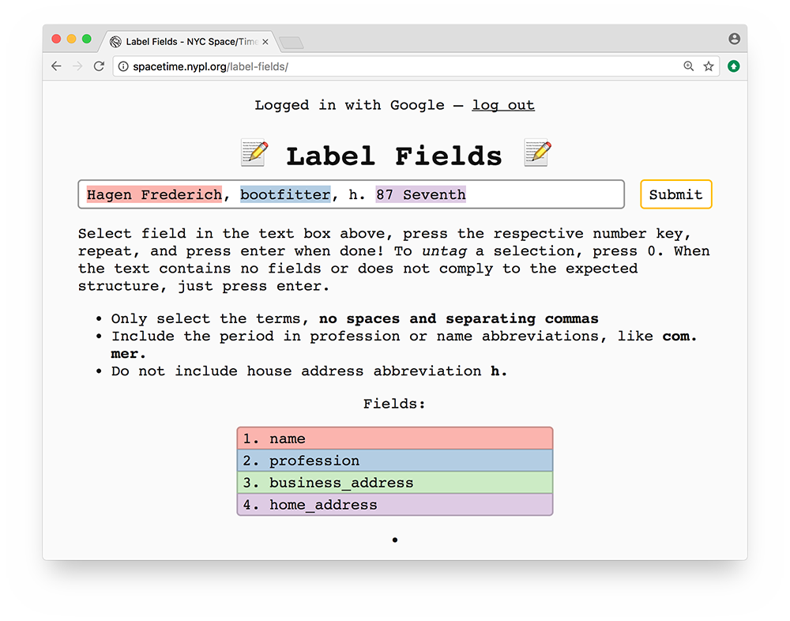

# Label Fields

Simple crowdsourcing tool for classifying and labeling training data for a conditional random field model (CRF) - used in [Space/Time Directory](http://spacetime.nypl.org) project to extract data from digitized New York City city directories.

Label Fields uses NYC Space/Time Directory's [brick-by-brick crowdsourcing API](https://github.com/nypl-spacetime/brick-by-brick).

## See also

- http://open.blogs.nytimes.com/2015/04/09/extracting-structured-data-from-recipes-using-conditional-random-fields/
- https://github.com/NYTimes/ingredient-phrase-tagger
